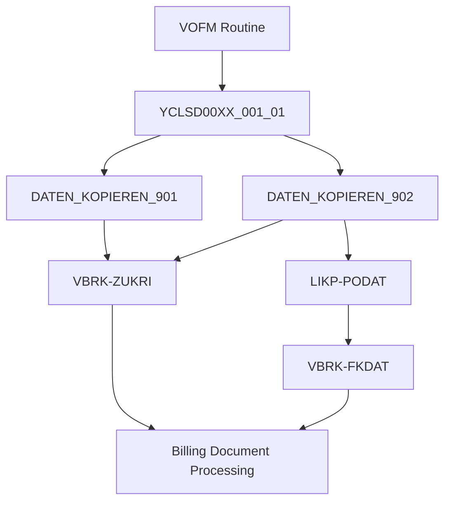

# Classical ABAP Demo1

这是一个 **SAP Classical ABAP** 开发示例。

本 Demo 主要用于说明基于 **VOFM Routine / ABAP Class** 的经典 ABAP 开发方式。

## 开发内容

- Classical ABAP
- VOFM Routine
- Data Transfer Routine
- `DATEN_KOPIEREN_901`
- `DATEN_KOPIEREN_902`
- ABAP Class
- Billing Document Header (`VBRK`)
- Delivery Header (`LIKP`)

## 示例概要

本 Demo 以销售与分销（SD）开票相关的 VOFM Routine 为例，将 VOFM Routine 的业务逻辑封装到 ABAP Class `YCLSD00XX_001_01` 中。

主要处理流程：

```text
VOFM Routine
        ↓
YCLSD00XX_001_01
        ↓
DATEN_KOPIEREN_901 / DATEN_KOPIEREN_902
        ↓
VBRK Billing Document Header
        ↓
Combination Criteria / Billing Date
```

## Classical ABAP Demo1 流程图



## 简要调用关系

1. VOFM Routine 调用 ABAP Class `YCLSD00XX_001_01`。
2. `DATEN_KOPIEREN_901` 根据 Customer Group 2 (`KVGR2`) 设置 Billing Document 的组合条件 `VBRK-ZUKRI`。
3. `DATEN_KOPIEREN_902` 同样设置组合条件 `VBRK-ZUKRI`。
4. `DATEN_KOPIEREN_902` 进一步检查 Delivery Header (`LIKP`) 的 POD Date (`PODAT`)。
5. 当 `LIKP-PODAT` 存在时，将其设置到 Billing Date `VBRK-FKDAT`。

## 目录结构

```text
demo1/
├── class/
│   └── YCLSD00XX_001_01.abap
└── README.md
```
