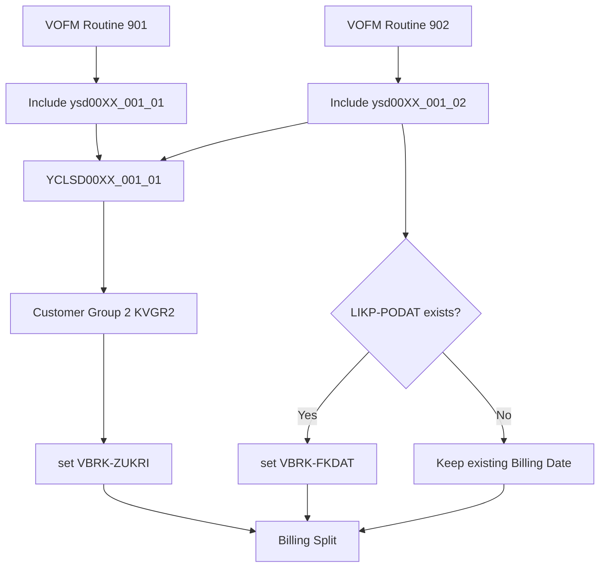

# Classical demo1

## 処理概要
本 Demo は、SD 請求処理における VOFM Routine と ABAP Class を使用した SAP 拡張の例です。

1. VOFM Routine 901 / 902 から Include を呼び出します。
2. Include から `YCLSD00XX_001_01` を呼び出します。
3. Customer Group 2（`KVGR2`）を使用して `VBRK-ZUKRI` を設定します。
4. Routine 902 では `LIKP-PODAT` が存在する場合、`VBRK-FKDAT` に設定します。

## 前提/制約条件

### 前提条件：
- Billing Document Header（`VBRK`）を処理対象とします。
- Customer Group 2（`KVGR2`）を請求分割条件として使用します。

### 制約条件：
- Routine 901 は `VBRK-ZUKRI` の設定による Billing Split を対象とします。
- Routine 902 は POD Date が存在する場合のみ Billing Date を更新します。
  
## 処理概要図


## 依存関係

### 使用公開API

| API名 | 種類 | 用途 |
|---|---|---|
| `VBRK` | Database Table | Billing Document Header の更新対象 |
| `LIKP` | Database Table | POD Date（`PODAT`）の取得 |
| `YCLSD00XX_001_01` | ABAP Class | 請求分割条件・Billing Date の業務ロジック |

## 詳細設計

### Case 1：出庫標準 901
```text
VOFM Routine 901
        ↓
Include ysd00XX_001_01
        ↓
YCLSD00XX_001_01
        ↓
Customer Group 2 (KVGR2)
        ↓
set Billing Document Header (VBRK-ZUKRI)
        ↓
Billing Split
```

### Case 2：收货標準 902
```text
VOFM Routine 902
        ↓
Include ysd00XX_001_02
        ↓
YCLSD00XX_001_01
        ↓
Customer Group 2 (KVGR2)
        ↓
set Billing Document Header (VBRK-ZUKRI)
        ↓
POD Date (LIKP-PODAT)
        ↓
set Billing Date (VBRK-FKDAT)
        ↓
Billing Split
```

## 補足情報

### 目录構造
```text
demo1/
├── class/
│   └── YCLSD00XX_001_01.abap
├── pgm/
│   ├── ysd00XX_001_01.abap
│   └── ysd00XX_001_02.abap
└── README.md
```

EOF
