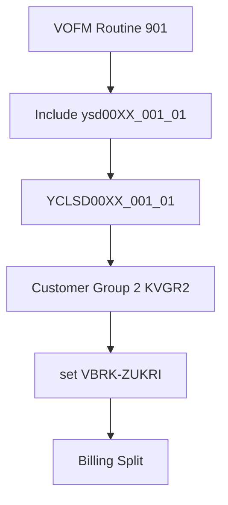
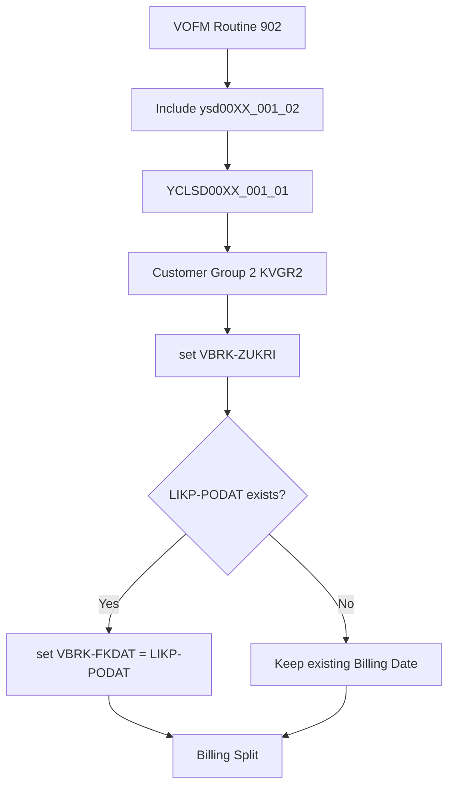

# Classical ABAP Demo1

这是一个 **SAP拡張** 的开发示例。

本 Demo 主要用于说明基于 **VOFM Routine / ABAP Class** 的 SAP 拡張开发方式。

## 开发内容

- SAP 拡張
- VOFM Routine
- Data Transfer Routine
- ABAP Class
- set Billing Document Header (`VBRK`)

## 示例概要

本 Demo 以销售与分销（SD）开票相关的 VOFM Routine 为例，使用客户组2（KVGR2）控制发票是否需要分开。

主要处理流程：

### Case 1：出库标准 901

```text
VOFM Routine 901
        ↓
Include ysd00XX_001_01
        ↓
YCLSD00XX_001_01
        ↓
Customer Group 2 (KVGR2)
        ↓
set Billing Document Header (VBRK-ZUKRI)
        ↓
Billing Split
```

### Case 2：收货标准 902

```text
VOFM Routine 902
        ↓
Include ysd00XX_001_02
        ↓
YCLSD00XX_001_01
        ↓
Customer Group 2 (KVGR2)
        ↓
set Billing Document Header (VBRK-ZUKRI)
        ↓
POD Date (LIKP-PODAT)
        ↓
set Billing Date (VBRK-FKDAT)
        ↓
Billing Split
```

## Classical ABAP Demo1 流程图

### Case 1：出库标准 901



### Case 2：收货标准 902



## 简要调用关系

1. **Case 1：出库标准 901**：VOFM Routine 901 通过 Include `ysd00XX_001_01` 调用 ABAP Class `YCLSD00XX_001_01`，根据客户组2（`KVGR2`）设置 Billing Document Header (`VBRK`) 的组合条件 `VBRK-ZUKRI`，从而控制发票是否需要分开。
2. **Case 2：收货标准 902**：VOFM Routine 902 通过 Include `ysd00XX_001_02` 调用 ABAP Class `YCLSD00XX_001_01`，首先根据客户组2（`KVGR2`）设置 `VBRK-ZUKRI`，然后检查收货日（POD Date，`LIKP-PODAT`）。当 `LIKP-PODAT` 存在时，将其设置为 Billing Date `VBRK-FKDAT`；如果不存在，则保持原有 Billing Date 不变。

## 目录结构

```text
demo1/
├── class/
│   └── YCLSD00XX_001_01.abap
├── pgm/
│   ├── ysd00XX_001_01.abap
│   └── ysd00XX_001_02.abap
└── README.md
```
