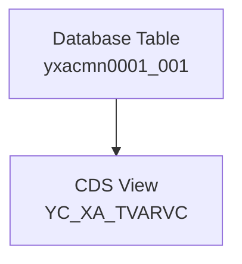

# Classical demo2

## 処理概要
本 Demo は固定値・選択バリアント関連の Database Table を使用した Classical ABAP のデータ定義例です。

1. Database Table `yxacmn0001_001` に選択バリアント情報を保持します。
2. Custom Data Elements と Domains を使用して各 Field の型を定義します。
3. CDS View `YC_XA_TVARVC` から Table Data を参照します。

## 前提/制約条件

### 前提条件：
- Database Table の Delivery Class は `C` とします。
- Data Maintenance は `X`（ALLOWED）とします。

### 制約条件：
- Table Field は定義済みの Data Element / Domain に従います。
- 本 Demo はデータ定義と参照関係を説明するものです。
  
## 処理概要図


## 依存関係

### 使用公開API

| API名 | 種類 | 用途 |
|---|---|---|
| `yxacmn0001_001` | Database Table | 選択バリアント情報の保持 |
| `YC_XA_TVARVC` | CDS View | Table Data の参照 |
| `ZEVARI_NAME` | Data Element | NAME Field の型定義 |
| `ZESEL_TYPE` | Data Element | TYPE Field の型定義 |
| `ZESEL_NUMB` | Data Element | NUMB Field の型定義 |
| `ZEDDSIGN` | Data Element | SIGN Field の型定義 |
| `ZEDDOPTION` | Data Element | OPTI Field の型定義 |
| `ZEVARI_VAL_255` | Data Element | LOW / HIGH Field の型定義 |

## 詳細設計

### Table delivery and Maintenance

| AbapCatalog | Value | 内容说明 |
|---|---|---|
| DeliveryClass | C | カスタマイジング、更新はカスタマのみ |
| DataMaintenance | X | ALLOWED |

### Fields

| Fields | Data Elements | Data Type | Length | Decimal | 内容说明 |
|---|---|---|---:|---:|---|
| MANDT | MANDT | CLNT | 3 | 0 | クライアント |
| NAME | ZEVARI_NAME | CHAR | 30 | 0 | バリアント変数名 |
| TYPE | ZESEL_TYPE | CHAR | 1 | 0 | 選択タイプ |
| NUMB | ZESEL_NUMB | NUMC | 3 | 0 | 現在の選択番号 |
| SIGN | ZEDDSIGN | CHAR | 1 | 0 | 範囲データ型の行データ型: タイプ SIGN のコンポーネント |
| OPTI | ZEDDOPTION | CHAR | 2 | 0 | 範囲データ型の行データ型のタイプ OPTION のコンポーネント |
| LOW | ZEVARI_VAL_255 | CHAR | 255 | 0 | 選択バリアント: 項目内容(LOW/HIGH) |
| HIGH | ZEVARI_VAL_255 | CHAR | 255 | 0 | 選択バリアント: 項目内容(LOW/HIGH) |

### 自定义 Data Elements

| Data Elements | Domains | Length | Decimal | 内容说明 |
|---|---|---:|---:|---|
| ZEVARI_NAME | ZDVARI_NAME | 30 | 0 | バリアント変数名 |
| ZESEL_TYPE | ZDSEL_TYPE | 1 | 0 | 選択タイプ |
| ZESEL_NUMB | ZDSEL_NUMB | 3 | 0 | 現在の選択番号 |
| ZEDDSIGN | ZDDDSIGN | 1 | 0 | 範囲データ型の行データ型: タイプ SIGN のコンポーネント |
| ZEDDOPTION | ZDDDOPTION | 2 | 0 | 範囲データ型の行データ型のタイプ OPTION のコンポーネント |
| ZEVARI_VAL_255 | ZDVARI_VAL_255 | 255 | 0 | 選択バリアント: 項目内容(LOW/HIGH) |

### 自定义 Domains

| Domains | Data Type | Length | Decimal | Output Length | 内容说明 |
|---|---|---:|---:|---:|---|
| ZDVARI_NAME | CHAR | 30 | 0 | 30 | バリアント変数名 |
| ZDSEL_TYPE | CHAR | 1 | 0 | 1 | 選択タイプ |
| ZDSEL_NUMB | NUMC | 3 | 0 | 3 | 現在の選択番号 |
| ZDDDSIGN | CHAR | 1 | 0 | 1 | 範囲データ型の行データ型: タイプ SIGN のコンポーネント |
| ZDDDOPTION | CHAR | 2 | 0 | 2 | 範囲データ型の行データ型のタイプ OPTION のコンポーネント |
| ZDVARI_VAL_255 | CHAR | 255 | 0 | 255 | 選択バリアント: 項目内容(LOW/HIGH) |

## 補足情報

### 目录構造
```text
demo2/
├── README.md
├── cds/
│   └── YC_XA_TVARVC.ddls
└── database table/
    ├── json/
    │   ├── data_elements.json
    │   ├── database_table.json
    │   └── domains.json
    └── table.ddl
```

EOF
