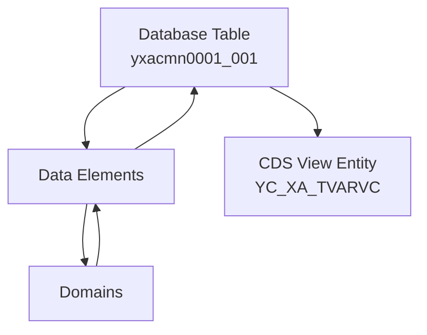

# Database Table

这是一个固定值表的示例。

## Table delivery and Maintenance

| AbapCatalog | Value | 内容说明 |
|---|---|---|
| DeliveryClass | C | カスタマイジング、更新はカスタマのみ |
| DataMaintenance | X | ALLOWED |

## Fields

| Fields | Data Elements | Data Type | Length | Decimal | 内容说明 |
|---|---|---|---:|---:|---|
| MANDT | MANDT | CLNT | 3 | 0 | クライアント |
| NAME | ZEVARI_NAME | CHAR | 30 | 0 | バリアント変数名 |
| TYPE | ZESEL_TYPE | CHAR | 1 | 0 | 選択タイプ |
| NUMB | ZESEL_NUMB | NUMC | 3 | 0 | 現在の選択番号 |
| SIGN | ZEDDSIGN | CHAR | 1 | 0 | 範囲データ型の行データ型: タイプ SIGN のコンポーネント |
| OPTI | ZEDDOPTION | CHAR | 2 | 0 | 範囲データ型の行データ型のタイプ OPTION のコンポーネント |
| LOW | ZEVARI_VAL_255 | CHAR | 255 | 0 | 選択バリアント: 項目内容(LOW/HIGH) |
| HIGH | ZEVARI_VAL_255 | CHAR | 255 | 0 | 選択バリアント: 項目内容(LOW/HIGH) |

## 自定义 Data Elements

| Data Elements | Domains | Length | Decimal | 内容说明 |
|---|---|---:|---:|---|
| ZEVARI_NAME | ZDVARI_NAME | 30 | 0 | バリアント変数名 |
| ZESEL_TYPE | ZDSEL_TYPE | 1 | 0 | 選択タイプ |
| ZESEL_NUMB | ZDSEL_NUMB | 3 | 0 | 現在の選択番号 |
| ZEDDSIGN | ZDDDSIGN | 1 | 0 | 範囲データ型の行データ型: タイプ SIGN のコンポーネント |
| ZEDDOPTION | ZDDDOPTION | 2 | 0 | 範囲データ型の行データ型のタイプ OPTION のコンポーネント |
| ZEVARI_VAL_255 | ZDVARI_VAL_255 | 255 | 0 | 選択バリアント: 項目内容(LOW/HIGH) |

## 自定义 Domains

| Domains | Data Type | Length | Decimal | Output Length | 内容说明 | More |
|---|---|---:|---:|---:|---|---|
| ZDVARI_NAME | CHAR | 30 | 0 | 30 | バリアント変数名 |  |
| ZDSEL_TYPE | CHAR | 1 | 0 | 1 | 選択タイプ | X |
| ZDSEL_NUMB | NUMC | 3 | 0 | 3 | 現在の選択番号 |  |
| ZDDDSIGN | CHAR | 1 | 0 | 1 | 範囲データ型の行データ型: タイプ SIGN のコンポーネント | X |
| ZDDDOPTION | CHAR | 2 | 0 | 2 | 範囲データ型の行データ型のタイプ OPTION のコンポーネント | X |
| ZDVARI_VAL_255 | CHAR | 255 | 0 | 255 | 選択バリアント: 項目内容(LOW/HIGH) |  |

## Flow

