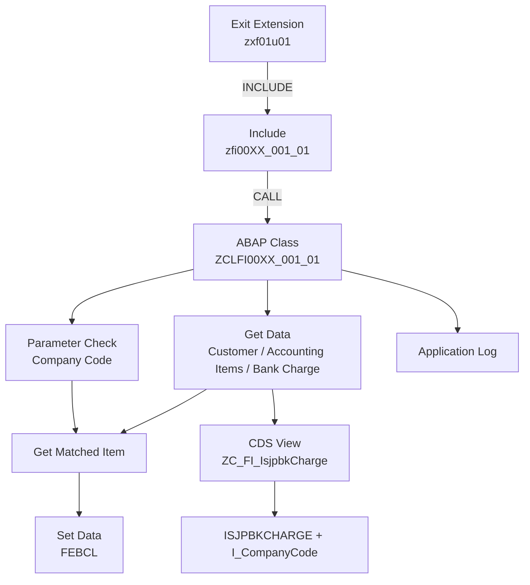

# Classical demo3

## 処理概要
本 Demo は FI Payment Clearing Enhancement の Classical ABAP 拡張例です。Exit Include から自定义 Class を呼び出し、銀行手续费配置を参照して清账対象を匹配し、結果を `FEBCL` に設定します。

1. `zxf01u01` 执行 Exit Extension 并 INCLUDE `zfi00XX_001_01`。
2. Include 调用 `ZCLFI00XX_001_01=>EXIT_RFEBBU10_001`。
3. Class 检查 Company Code 参数。
4. 取得 Customer、未清 Accounting Items 和 Bank Charge 配置。
5. 根据 Payment Amount 与 Bank Charge Amount 匹配 Accounting Items。
6. 将匹配结果写入 `FEBCL`，异常时记录 Application Log。

## 前提/制約条件

### 前提条件：
- Company Code 必须满足参数 `ZFI001` 且参数值为 `true`。
- Bank Charge 配置由 `ZC_FI_IsjpbkCharge` 提供。
- Payment Clearing Process 使用 `FEBCL` 作为清账项目数据。

### 制約条件：
- Customer、Accounting Item、Bank Charge 或 Matching 数据无法取得时结束处理并记录 Application Log。
- Matching 需要满足 Bank Charge Amount 的金额条件。
  
## 処理概要図


## 依存関係

### 使用公開API

| API名 | 種類 | 用途 |
|---|---|---|
| `I_AddlCompanyCodeInformation` | CDS View | Company Code Parameter Check |
| `I_CustomerCompany` | CDS View | Customer の取得 |
| `I_OperationalAcctgDocItem` | CDS View | 未清 Accounting Item の取得 |
| `ZC_FI_IsjpbkCharge` | CDS View Entity | Bank Charge Configuration |
| `ISJPBKCHARGE` | Database Table | Bank Charge Configuration Data |
| `I_CompanyCode` | CDS View | Company Code Currency |
| `FEBCL` | Database Table | Payment Clearing Data |
| `CL_BALI_LOG` | ABAP Class | Application Log |

## 詳細設計

### Class Processing

入口 Method：`EXIT_RFEBBU10_001`

```text
parameter_check
      ↓
get_data
      ↓
get_matched_item
      ↓
set_data
```

### PARAMETER_CHECK
`I_AddlCompanyCodeInformation` を使用して Company Code に `ZFI001` パラメータが存在し、値が `true` かを確認します。失敗時は `CREATE_APP_LOG` を呼び出します。

### GET_DATA
- `I_CustomerCompany` から Customer を取得します。
- `I_OperationalAcctgDocItem` から未清 Accounting Document Items を取得します。
- `ZC_FI_IsjpbkCharge` から Company Code と Bank Charge Pattern ID に対応する Bank Charge Amount を取得します。

### GET_MATCHED_ITEM
複数 Accounting Items の合計または単一 Accounting Item の金額と Payment Amount の差額を Bank Charge Amount と比較し、清账対象を決定します。

### SET_DATA
匹配結果を `FEBCL` に設定します。

| FEBCL Field | 来源/固定值 |
|---|---|
| `KUKEY` | `FEBEP-KUKEY` |
| `ESNUM` | `FEBEP-ESNUM` |
| `CSNUM` | 顺序编号 |
| `KOART` | `D` |
| `AGKON` | Customer |
| `SELFD` | `BELNR` |
| `SELVON` | Accounting Document |
| `SELBIS` | 空值 |

### Application Log
使用 `CL_BALI_LOG`、`CL_BALI_HEADER_SETTER`、`CL_BALI_MESSAGE_SETTER` 和 `CL_BALI_LOG_DB` 记录异常。

## 補足情報

### 目录構造
```text
demo3/
├── README.md
├── cds/
│   └── ZC_FI_IsjpbkCharge.cds
├── class/
│   └── ZCLFI00XX_001_01.abap
└── pgm/
    ├── zfi00XX_001_01.abap
    └── zxf01u01.abap
```

EOF
