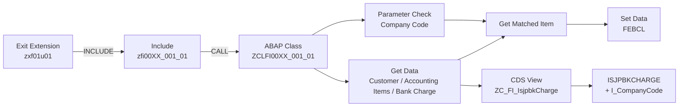
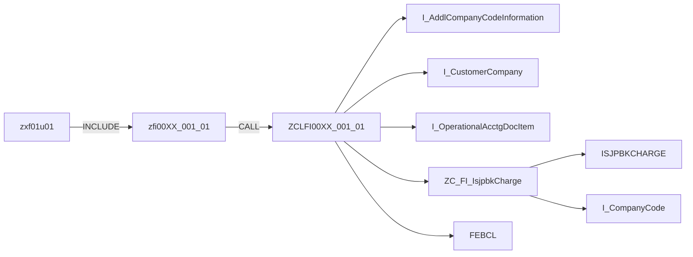

# SAP 拡張 Demo3 - Payment Clearing Enhancement

这是一个 **SAP 拡張** 的 ABAP 开发示例，以 FI 收款/银行付款清账处理为主题，展示如何通过经典 ABAP Exit Include 调用自定义 Class，并结合 CDS View Entity 读取银行手续费配置数据。

## 1. Demo Overview

本 Demo 的核心处理是：

1. 通过 `zxf01u01` 执行 Exit Extension。
2. `zxf01u01` INCLUDE `zfi00XX_001_01`。
3. `zfi00XX_001_01` 调用 `ZCLFI00XX_001_01=>EXIT_RFEBBU10_001`。
4. Class 首先检查 Company Code 是否允许执行该增强处理。
5. 读取客户、未清会计凭证项目以及银行手续费配置。
6. 根据入账金额与银行手续费规则匹配需要清账的会计凭证。
7. 将匹配结果写入 `FEBCL`，供后续 Payment Clearing Process 使用。
8. 处理异常时通过 Application Log 记录错误信息。

## 2. Directory Structure

```text
demo3/
├── README.md
├── cds/
│   └── ZC_FI_IsjpbkCharge.cds
├── class/
│   └── ZCLFI00XX_001_01.abap
└── pgm/
    ├── zfi00XX_001_01.abap
    └── zxf01u01.abap
```

## 3. Object Description

| Folder | Object | 内容说明 |
|---|---|---|
| `cds` | `ZC_FI_IsjpbkCharge` | 银行手续费配置的 CDS View Entity |
| `class` | `ZCLFI00XX_001_01` | Payment Clearing Enhancement 的主要业务逻辑 |
| `pgm` | `zfi00XX_001_01` | Exit Include，通过 Class Method 启动清账增强处理 |
| `pgm` | `zxf01u01` | Exit Extension 的入口 Include，并 INCLUDE `zfi00XX_001_01` |

## 4. Processing Flow



## 5. CDS View

`ZC_FI_IsjpbkCharge` 是一个 CDS View Entity，用于取得银行手续费配置。

主要数据来源：

- `isjpbkcharge`：银行手续费模式/金额配置
- `I_CompanyCode`：Company Code 的币种信息

主要输出字段：

| Field | 说明 |
|---|---|
| `CompanyCode` | Company Code |
| `BankChargePatternID` | 银行手续费 Pattern ID |
| `SequentialNumber` | Sequential Number |
| `Operator` | Operator |
| `BankChargeAmount` | 银行手续费金额 |
| `currency` | Company Code Currency |

`BankChargeAmount` 使用 `@Semantics.amount.currencyCode: 'currency'` 与币种字段建立金额/币种语义关联。

## 6. Class Processing

### 6.1 `EXIT_RFEBBU10_001`

Class 的主要入口 Method。

处理顺序：

```text
parameter_check
      ↓
get_data
      ↓
get_matched_item
      ↓
set_data
```

如果任一步骤无法取得必要数据，则直接结束处理。

### 6.2 `PARAMETER_CHECK`

根据传入的 Company Code 查询 `I_AddlCompanyCodeInformation`，判断 Company Code 是否存在参数 `ZFI001` 且参数值为 `true`。检查失败时调用 `CREATE_APP_LOG`。

### 6.3 `GET_DATA`

取得后续匹配所需要的数据：

- 通过 `I_CustomerCompany`，使用 `FEBEP-PARTN` 对应的 Accounting Clerk Phone Number 查找 Customer。
- 通过 `I_OperationalAcctgDocItem` 取得尚未清账的 Accounting Document Items，并计算 `AddedDate` 后排序。
- 通过 `ZC_FI_IsjpbkCharge` 根据 Company Code 和 Bank Charge Pattern ID 取得 Bank Charge Amount。

### 6.4 `GET_MATCHED_ITEM`

该 Method 是本 Demo 的核心匹配逻辑。

首先取得手续费配置中的最大手续费，然后进行两种匹配。

**多个 Accounting Items 合计：**

```text
Accounting Items Total
        ↓
Total Amount - Payment Amount
        ↓
Bank Charge Amount
```

当差额等于配置中的 `BankChargeAmount` 时，确定目标清账项目；同时要求差额不能超过最大手续费。

**单个 Accounting Item：**

```text
Accounting Item Amount - Payment Amount
                ↓
         Bank Charge Amount
```

如果差额等于银行手续费配置，则确定目标项目。

### 6.5 `SET_DATA`

将匹配到的 Accounting Documents 转换为 `FEBCL` 数据。

| FEBCL Field | 来源/固定值 |
|---|---|
| `KUKEY` | `FEBEP-KUKEY` |
| `ESNUM` | `FEBEP-ESNUM` |
| `CSNUM` | 顺序编号 |
| `KOART` | `D` |
| `AGKON` | Customer |
| `SELFD` | `BELNR` |
| `SELVON` | Accounting Document |
| `SELBIS` | 空值 |

### 6.6 `CREATE_APP_LOG`

使用 BAL API 创建 Application Log：

- Object：`ZFI`
- Subobject：`ZFI0009_001_01`
- `CL_BALI_LOG`
- `CL_BALI_HEADER_SETTER`
- `CL_BALI_MESSAGE_SETTER`
- `CL_BALI_LOG_DB`

## 7. Main Dependencies



## 8. Error Handling

本 Demo 在 Company Code 参数检查、Customer、Accounting Item、Bank Charge 数据取得或最终匹配失败时，通过 Application Log 记录错误信息。

主要 Message Number：

| Number | 场景 |
|---|---|
| `004` | Company Code 参数检查失败 |
| `005` | Customer / Accounting Item / Bank Charge / Matching 数据取得或匹配失败 |

实际 Message Text 通过 Class 中的 `TEXT-001` ～ `TEXT-005` 提供。

## 9. ABAP Development Pattern

本 Demo 主要体现以下 SAP ABAP 开发方式：

- Classical ABAP Exit / Include Extension
- 自定义 Global Class 封装业务逻辑
- Static Method 调用
- CDS View Entity 作为数据访问层
- Released CDS View / Interface View 的数据读取
- Internal Table 数据处理
- Sorted Table + Table Expression 进行金额匹配
- Application Log（BAL）错误记录
- `FEBCL` 清账项目数据构建

整体设计将 **Exit Include、业务逻辑 Class、CDS 数据读取** 分离，避免将大量业务逻辑直接写在 Include 中。
