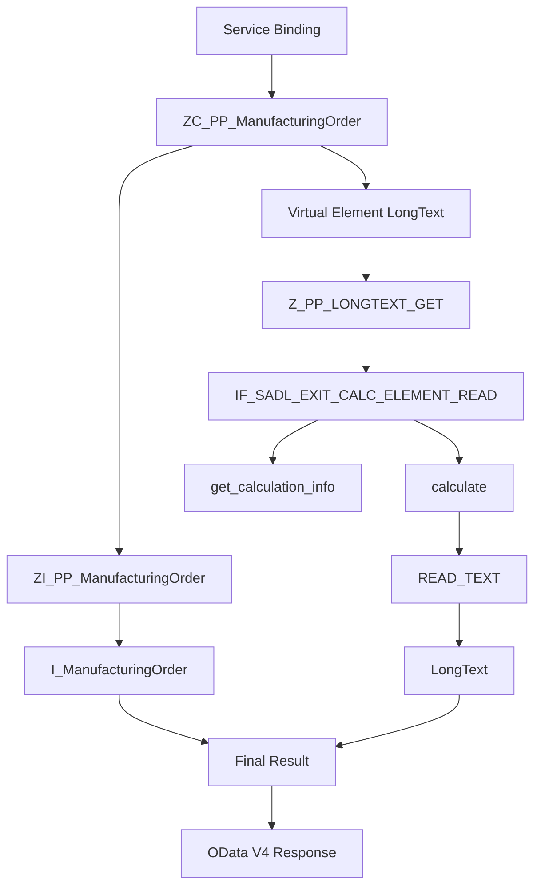

# rap demo1

## 処理概要
本 Demo は SAP RAP（RESTful ABAP Programming Model）を使用した OData V4 Web API の例です。Manufacturing Order を取得し、Virtual Element `LongText` を SADL Exit で実行時に計算します。

1. Service Binding 通过 OData V4 Web API 对外提供 Service。
2. Projection View `ZC_PP_ManufacturingOrder` 作为对外数据模型。
3. `ZC_PP_ManufacturingOrder` 基于 `ZI_PP_ManufacturingOrder`。
4. Virtual Element `LongText` 在运行时由 SADL Exit `Z_PP_LONGTEXT_GET` 计算。
5. `READ_TEXT` 根据生产订单对应的 `Tdname` 读取长文本并返回最终结果。

## 前提/制約条件

### 前提条件：
- 使用 RAP Service Binding 暴露 OData V4 Web API。
- `ZC_PP_ManufacturingOrder` 中存在 Virtual Element `LongText`。
- SADL Exit Class 实现 `IF_SADL_EXIT_CALC_ELEMENT_READ`。

### 制約条件：
- `LongText` 不是直接从数据库读取的字段。
- 长文本读取依赖生产订单对应的 `Tdname`。
  
## 処理概要図


## 依存関係

### 使用公開API

| API名 | 種類 | 用途 |
|---|---|---|
| `I_ManufacturingOrder` | CDS View | Manufacturing Order Data の取得 |
| `ZI_PP_ManufacturingOrder` | CDS View Entity | Interface / Composite Data Model |
| `ZC_PP_ManufacturingOrder` | CDS Projection View | OData V4 の対外データモデル |
| `Z_PP_LONGTEXT_GET` | ABAP Class | Virtual Element の計算 |
| `IF_SADL_EXIT_CALC_ELEMENT_READ` | ABAP Interface | SADL Calculation Exit の実装 |
| `READ_TEXT` | Function Module | Long Text の取得 |

## 詳細設計

### Service / CDS
- Service Binding → Service Definition → Projection View → Interface / Composite View の構成です。
- `ZI_PP_ManufacturingOrder` は `I_ManufacturingOrder`、System Status、Production Version、Product Text、Inventory Usability Text、Long Text Mapping などを組み合わせます。

### Virtual Element
`LongText` は Virtual Element であり、SADL が `Z_PP_LONGTEXT_GET` を呼び出します。

処理順序：
```text
Virtual Element LongText
        ↓
Z_PP_LONGTEXT_GET
        ↓
get_calculation_info
        ↓
calculate
        ↓
READ_TEXT
        ↓
LongText
```

### 主要データ
| Field / Object | 用途 |
|---|---|
| `Tdname` | Long Text の Text Name |
| `LongText` | Runtime Calculation Result |
| `I_ManufacturingOrder` | Manufacturing Order Data |
| `ZI_PP_LongTextMapping` | Long Text Name / Mapping Data |

## 補足情報

### 目录構造
```text
demo1/
├── README.md
├── cds/
│   ├── ZC_PP_ManufacturingOrder
│   ├── ZI_PP_ACMSystemStatus
│   ├── ZI_PP_LongTextMapping
│   └── ZI_PP_ManufacturingOrder
└── class/
    └── z_pp_longtext_get.abap
```

EOF
