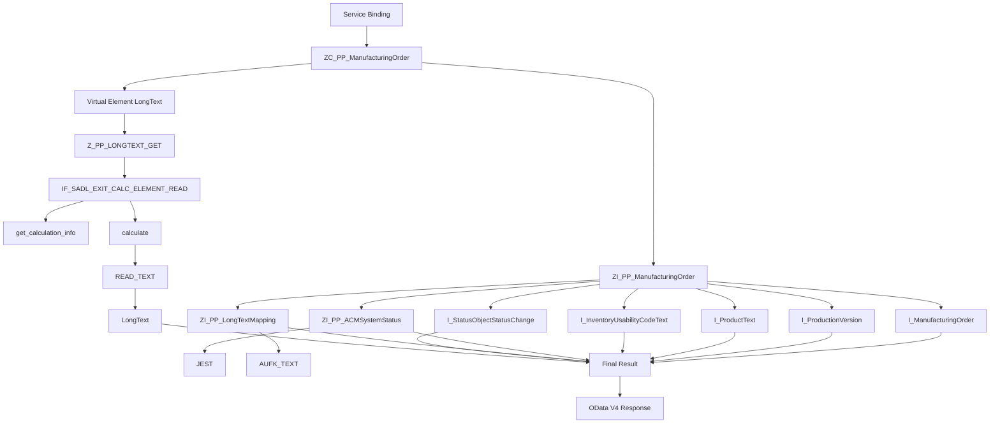

# 

## 処理概要
本 Demo は SAP RAP（RESTful ABAP Programming Model）を使用した OData V4 Web API の例です。Manufacturing Order を取得し、Virtual Element `LongText` を SADL Exit で実行時に計算します。

1. Service Binding 通过 OData V4 Web API 对外提供 Service。
2. Projection View `ZC_PP_ManufacturingOrder` 作为对外数据模型。
3. `ZC_PP_ManufacturingOrder` 基于 `ZI_PP_ManufacturingOrder`。
4. `ZI_PP_ManufacturingOrder` 结合 Manufacturing Order、Production Version、Product Text、Inventory Usability Text、System Status、Status Change History、Long Text Mapping 等数据。
5. Virtual Element `LongText` 在运行时由 SADL Exit `Z_PP_LONGTEXT_GET` 计算。
6. `READ_TEXT` 根据生产订单对应的 `Tdname` 读取长文本并返回最终结果。

## 前提/制約条件

### 前提条件：
- 使用 RAP Service Binding 暴露 OData V4 Web API。
- `ZC_PP_ManufacturingOrder` 中存在 Virtual Element `LongText`。
- SADL Exit Class 实现 `IF_SADL_EXIT_CALC_ELEMENT_READ`。

### 制約条件：
- `LongText` 不是直接从数据库读取的字段。
- 长文本读取依赖生产订单对应的 `Tdname`。
  
## 処理概要図


## 依存関係

### 使用公開API

| API名 | 種類 | 用途 |
|---|---|---|
| `I_ManufacturingOrder` | SAP Standard CDS View | Manufacturing Order 基本データの取得 |
| `I_ProductionVersion` | SAP Standard CDS View | Production Version / Production Version Text の取得 |
| `I_ProductText` | SAP Standard CDS View | Product Name の取得 |
| `I_InventoryUsabilityCodeText` | SAP Standard CDS View | Inventory Usability Code の名称取得 |
| `I_StatusObjectStatusChange` | SAP Standard CDS View | Order Status Change History / Order Issuance Date の取得 |
| `ZI_PP_ACMSystemStatus` | Custom CDS View Entity | `JEST` から System Status を取得し、Created / Released / TechnicallyCompleted / DeletionFlag を算出 |
| `ZI_PP_LongTextMapping` | Custom CDS View Entity | `AUFK_TEXT` から Manufacturing Order と Long Text Name (`Tdname`) の対応を取得 |
| `JEST` | Database Table | System Status (`OBJNR`, `STAT`, `INACT`, `CHGNR`) の取得元 |
| `AUFK_TEXT` | Database Table | Manufacturing Order Long Text Name (`TDNAME`) の取得元 |
| `ZC_PP_ManufacturingOrder` | Custom CDS Projection View | OData V4 の対外データモデル |
| `ZI_PP_ManufacturingOrder` | Custom CDS View Entity | Manufacturing Order を各種 CDS / DB データと結合する Composite Data Model |
| `Z_PP_LONGTEXT_GET` | Custom ABAP Class | Virtual Element `LongText` の計算 |
| `IF_SADL_EXIT_CALC_ELEMENT_READ` | ABAP Interface | SADL Calculation Exit の実装 |
| `READ_TEXT` | Function Module | Manufacturing Order Long Text の取得 |

## 詳細設計

### Service / CDS
- Service Binding → Service Definition → Projection View → Interface / Composite View の構成です。
- `ZI_PP_ManufacturingOrder` は以下の CDS / DB オブジェクトを組み合わせます。
  - `I_ManufacturingOrder`
  - `I_ProductionVersion`
  - `I_ProductText`
  - `I_InventoryUsabilityCodeText`
  - `ZI_PP_ACMSystemStatus` → `JEST`
  - `ZI_PP_LongTextMapping` → `AUFK_TEXT`
  - `I_StatusObjectStatusChange`
- `ZC_PP_ManufacturingOrder` は `ZI_PP_ManufacturingOrder` を Projection し、OData V4 の対外データモデルとして公開します。
- `ZI_PP_ManufacturingOrder` 内では複数の System Status Profile (`I0001`, `I0002`, `I0045`, `I0076`) を `ZI_PP_ACMSystemStatus` に対して参照し、Created / Released / TechnicallyCompleted / DeletionFlag を算出します。

### Virtual Element
`LongText` は Virtual Element であり、SADL が `Z_PP_LONGTEXT_GET` を呼び出します。

処理順序：
```text
Virtual Element LongText
        ↓
Z_PP_LONGTEXT_GET
        ↓
get_calculation_info
        ↓
calculate
        ↓
READ_TEXT
        ↓
LongText
```

### 主要データ
| Field / Object | 用途 |
|---|---|
| `Tdname` | Long Text の Text Name |
| `LongText` | Runtime Calculation Result |
| `I_ManufacturingOrder` | Manufacturing Order Data |
| `I_ProductionVersion` | Production Version Data |
| `I_ProductText` | Product Name Data |
| `I_InventoryUsabilityCodeText` | Inventory Usability Code Text |
| `ZI_PP_ACMSystemStatus` / `JEST` | System Status Data |
| `ZI_PP_LongTextMapping` / `AUFK_TEXT` | Manufacturing Order と Long Text Name の Mapping |
| `I_StatusObjectStatusChange` | Status Change History |

## 補足情報

### 目录構造
```text
demo1/
├── README.md
├── cds/
│   ├── ZC_PP_ManufacturingOrder
│   ├── ZI_PP_ACMSystemStatus
│   ├── ZI_PP_LongTextMapping
│   └── ZI_PP_ManufacturingOrder
└── class/
    └── z_pp_longtext_get.abap
```

EOF
