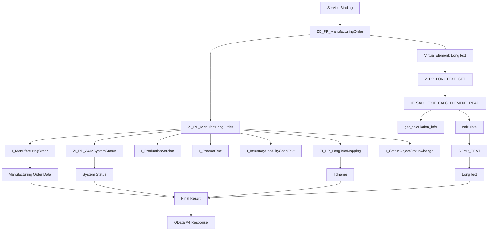

# RAP Demo1

这是一个 **SAP RAP（RESTful ABAP Programming Model）** 开发示例。

本 Demo 主要用于说明 **OData V4 - Web API** 的 RAP 开发方式。

## 开发内容

- RAP（RESTful ABAP Programming Model）
- OData V4 - Web API
- CDS View Entity
- Projection View
- Virtual Element
- SADL Exit
- `IF_SADL_EXIT_CALC_ELEMENT_READ`
- OData V4 Service Binding

## 示例概要

本 Demo 以生产订单（Manufacturing Order）为例，通过 RAP 构建 OData V4 Web API Service，并通过 Virtual Element 在运行时计算 Long Text 数据。

主要处理流程：

```text
OData V4 - Web API
        ↓
Service Binding
        ↓
Service Definition
        ↓
Projection View
ZC_PP_ManufacturingOrder
        ↓
Interface / Composite View
ZI_PP_ManufacturingOrder
        ↓
OData V4 Response
```

## RAP Demo1 流程图



## 简要调用关系

1. Service Binding 对外暴露 RAP Service。
2. Service Definition 定义对外暴露的 RAP Service 对象。
3. Projection View `ZC_PP_ManufacturingOrder` 作为对外数据模型。
4. `ZC_PP_ManufacturingOrder` 基于 `ZI_PP_ManufacturingOrder`。
5. `ZI_PP_ManufacturingOrder` 从 `I_ManufacturingOrder` 获取生产订单，并通过 Join / Association 获取状态、生产版本、产品文本、库存可用性文本、长文本名称等数据。
6. Virtual Element `LongText` 不直接从数据库读取，而是在运行时由 RAP/SADL 机制计算。
7. SADL Exit `Z_PP_LONGTEXT_GET` 实现 `IF_SADL_EXIT_CALC_ELEMENT_READ`，由 SADL 在处理 Virtual Element 时调用 `calculate` 等方法。
8. `READ_TEXT` 根据生产订单对应的 `Tdname` 读取长文本内容，并将结果写入 Virtual Element `LongText`。
9. RAP Service 最终通过 OData V4 Web API 返回包含计算结果的数据。

## 目录结构

```text
demo1/
├── cds/
│   ├── ZC_PP_ManufacturingOrder
│   ├── ZI_PP_ACMSystemStatus
│   ├── ZI_PP_LongTextMapping
│   └── ZI_PP_ManufacturingOrder
├── scl/
│   └── z_pp_longtext_get.abap
└── README.md
```
