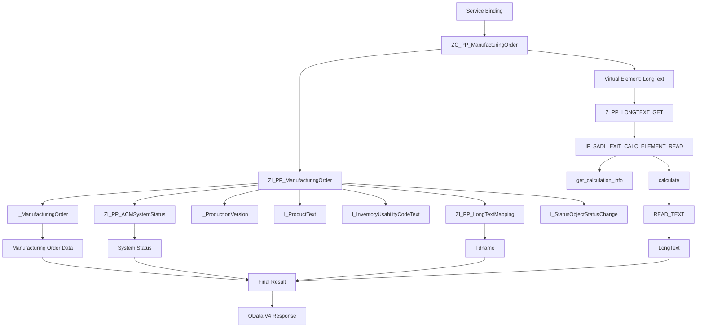

# RAP Demo1 流程图

## 简要调用关系

1. Service Binding 对外暴露 RAP Service。
2. Projection View `ZC_PP_ManufacturingOrder` 作为对外数据模型。
3. `ZC_PP_ManufacturingOrder` 基于 `ZI_PP_ManufacturingOrder`。
4. `ZI_PP_ManufacturingOrder` 从 `I_ManufacturingOrder` 获取生产订单，并通过 Join / Association 获取状态、生产版本、产品文本、库存可用性文本、长文本名称等数据。
5. `LongText` 是 Virtual Element，不直接从 CDS 数据库查询。
6. SADL 在处理 Virtual Element 时调用 `Z_PP_LONGTEXT_GET` 的 `IF_SADL_EXIT_CALC_ELEMENT_READ` 实现。
7. `calculate` 根据 `Tdname` 调用 `READ_TEXT` 获取长文本，并将结果写入 `LongText`。
8. SADL 将 CDS 数据和计算出的 `LongText` 组合后，通过 OData V4 返回最终结果。
