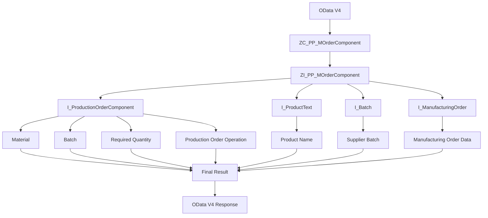

# RAP Demo2

这是一个 **SAP RAP（RESTful ABAP Programming Model）** 开发示例。
 
本 Demo 主要用于说明基于 **Manufacturing Order Component（生产订单组件）** 的 RAP / OData V4 开发方式。

## 开发内容

- RAP（RESTful ABAP Programming Model）
- OData V4
- CDS View Entity
- Consumption View
- Composite View
- CDS Association
- Manufacturing Order Component
- Batch / Supplier Batch

## 示例概要

本 Demo 以生产订单组件（Manufacturing Order Component）为例，通过 CDS View Entity 构建数据模型。

主要处理流程：

```text
OData V4
        ↓
Consumption View
ZC_PP_MOrderComponent
        ↓
Composite View
ZI_PP_MOrderComponent
        ↓
I_ManufacturingOrder
        ↓
I_ProductionOrderComponent
        ↓
Product / Batch Information
        ↓
OData V4 Response
```

## RAP Demo2 流程图



## 简要调用关系

1. OData V4 Service 对外提供 RAP Service。
2. Consumption View `ZC_PP_MOrderComponent` 作为对外数据模型。
3. `ZC_PP_MOrderComponent` 基于 `ZI_PP_MOrderComponent`。
4. `ZI_PP_MOrderComponent` 从 `I_ManufacturingOrder` 获取生产订单数据。
5. `ZI_PP_MOrderComponent` Inner Join `I_ProductionOrderComponent`，获取生产订单组件数据。
6. 通过 `I_ProductText` 获取 Material 对应的 Product Name。
7. 通过 `I_Batch` 获取 Batch 对应的 Supplier Batch，并根据 Plant 判断使用 Plant Batch 或通用 Batch 数据。
8. `ZC_PP_MOrderComponent` 将生产订单、Material、Batch、数量、生产工序、库存地点、Supplier Batch 等数据作为最终结果返回。

## 目录结构

```text
demo2/
├── Service Bindings       <-dummy
├── Service Definitions    <-dummy
├── cds/
│   ├── ZC_PP_MOrderComponent.cds
│   └── ZI_PP_MOrderComponent.cds
└── README.md
```
