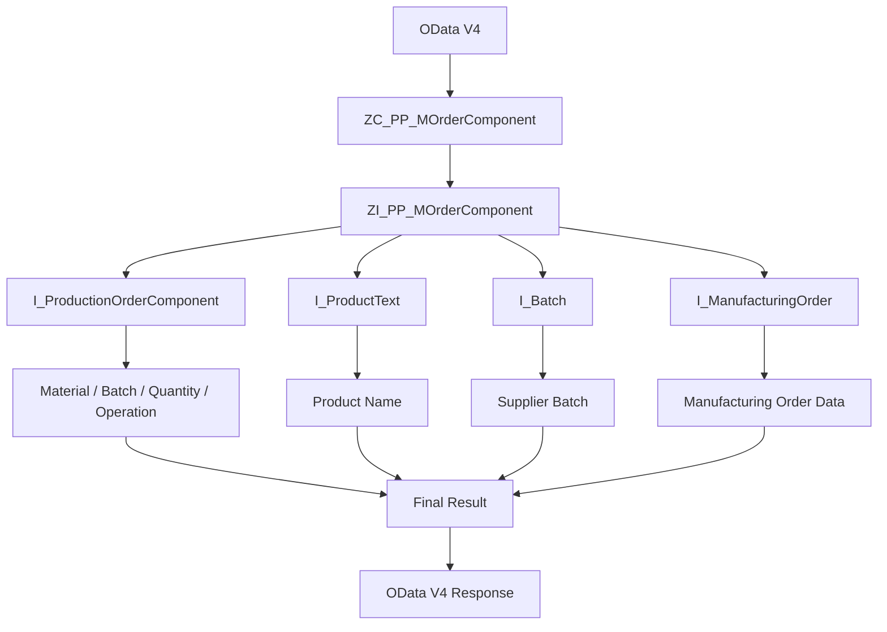

# rap demo2

## 処理概要
本 Demo は Manufacturing Order Component を対象とした RAP / OData V4 Data Model の例です。

1. Consumption View `ZC_PP_MOrderComponent` 作为对外数据模型。
2. `ZC_PP_MOrderComponent` 基于 `ZI_PP_MOrderComponent`。
3. `ZI_PP_MOrderComponent` 从 `I_ManufacturingOrder` 获取生产订单数据。
4. Inner Join `I_ProductionOrderComponent` 获取生产订单组件。
5. `I_ProductText` 提供 Product Name，`I_Batch` 提供 Supplier Batch。
6. 最终返回生产订单、Material、Batch、数量、生产工序、库存地点和 Supplier Batch 等数据。

## 前提/制約条件

### 前提条件：
- 使用 OData V4 / RAP Service 对外提供数据。
- `ZC_PP_MOrderComponent` 作为 Consumption View。
- Manufacturing Order Component Data 由相关 CDS View 获取。

### 制約条件：
- Product Name 依赖 `I_ProductText`。
- Supplier Batch 依赖 `I_Batch` 以及 Plant / Batch 条件。
  
## 処理概要図


## 依存関係

### 使用公開API

| API名 | 種類 | 用途 |
|---|---|---|
| `I_ManufacturingOrder` | CDS View | Manufacturing Order Data |
| `I_ProductionOrderComponent` | CDS View | Production Order Component Data |
| `I_ProductText` | CDS View | Product Name |
| `I_Batch` | CDS View | Batch / Supplier Batch |
| `ZI_PP_MOrderComponent` | CDS View Entity | Composite Data Model |
| `ZC_PP_MOrderComponent` | CDS Consumption View | OData V4 Response |

## 詳細設計

### CDS View Structure
```text
OData V4
        ↓
Consumption View
ZC_PP_MOrderComponent
        ↓
Composite View
ZI_PP_MOrderComponent
        ↓
I_ManufacturingOrder
        ↓
I_ProductionOrderComponent
        ↓
Product / Batch Information
        ↓
OData V4 Response
```

### Data Processing
- `I_ProductionOrderComponent` 提供 Material、Batch、Required Quantity、Production Order Operation 等数据。
- `I_ProductText` 根据 Material 获取 Product Name。
- `I_Batch` 获取 Supplier Batch，并根据 Plant 判断使用 Plant Batch 或通用 Batch 数据。
- Consumption View 返回生产订单、Material、Batch、数量、生产工序、库存地点和 Supplier Batch。

### 目录结构
```text
demo2/
├── Service Bindings
├── Service Definitions
├── cds/
│   ├── ZC_PP_MOrderComponent.cds
│   └── ZI_PP_MOrderComponent.cds
└── README.md
```

## 補足情報

### 消息内容

| メッセージ内容 | 設定内容 |
|---|---|
| Product Name | `I_ProductText` から取得 |
| Supplier Batch | `I_Batch` から取得 |
| OData V4 Response | Consumption View の最終結果を返却 |

EOF
