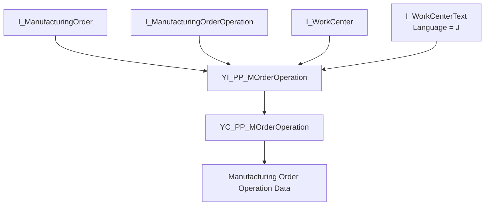

# rap demo3

## 処理概要
1. `YI_PP_MOrderOperation` をコンポジットビューとして定義し、`I_ManufacturingOrder` と `I_ManufacturingOrderOperation` を製造指図番号で結合する。
2. `YI_PP_MOrderOperation` で `I_WorkCenter` を結合し、`I_WorkCenterText` を言語 `J` の条件で関連付けて、製造指図工程とワークセンタ情報を取得する。
3. `YC_PP_MOrderOperation` で `YI_PP_MOrderOperation` の項目を公開し、変更日が存在しない場合は作成日時、存在する場合は変更日時から `LastChangeTimestamp` を算出する。

## 前提/制約条件

### 前提条件：
- `YI_PP_MOrderOperation` および `YC_PP_MOrderOperation` が参照する SAP 標準 CDS が利用可能であること。
  
### 制約条件：
- `I_WorkCenterText` の取得条件は言語 `J` に固定されている。
  
## 処理概要図



## 依存関係

### 使用公開API

| API名 | 種類 | 用途 |
|---|---|---|
| `YI_PP_MOrderOperation` | カスタム CDS View Entity | 製造指図と工程、ワークセンタ情報を結合したコンポジットデータを提供する。 |
| `YC_PP_MOrderOperation` | カスタム CDS View Entity | `YI_PP_MOrderOperation` を参照し、消費用の製造指図工程データを提供する。 |
| `I_ManufacturingOrder` | SAP 標準 CDS View | 製造指図の基本情報、製造プラント、製造指図タイプ、作成日時および変更日時を取得する。 |
| `I_ManufacturingOrderOperation` | SAP 標準 CDS View | 製造指図工程の基本情報、工程テキスト、工程日付、管理キー、外注関連情報および購買情報レコードを取得する。 |
| `I_WorkCenter` | SAP 標準 CDS View | 工程に対応するワークセンタを取得する。 |
| `I_WorkCenterText` | SAP 標準 CDS View | ワークセンタ名称を取得する。言語 `J` の関連付け条件で使用する。 |
| `dats_tims_to_tstmp` | CDS 組み込み関数 | 日付・時刻をタイムスタンプへ変換する。 |
| `abap_system_timezone` | CDS 組み込み関数 | セッションのクライアントに対応するシステムタイムゾーンを取得する。 |

## 詳細設計
`YI_PP_MOrderOperation` は `I_ManufacturingOrder` を起点として、`I_ManufacturingOrderOperation` を `ManufacturingOrder` で Inner Join する。さらに `I_WorkCenter` を `WorkCenterInternalID` と `WorkCenterTypeCode` で Left Outer Join し、`I_WorkCenterText` を同じワークセンタ識別情報に加えて `Language = 'J'` の条件で `[0..1]` Association として定義する。

`YI_PP_MOrderOperation` では、製造指図番号、製造指図カテゴリ、製造指図工程番号をキーとして、工程テキスト、ワークセンタ、ワークセンタテキスト、工程予定日時、管理プロファイル、外注工程フラグ、購買情報レコード、製造プラント、製造指図タイプ、作成日時および変更日時を公開する。

`YC_PP_MOrderOperation` は `YI_PP_MOrderOperation` を `select from` して、これらの項目を消費用ビューとして公開する。`LastChangeTimestamp` は `@Semantics.systemDateTime.lastChangedAt: true` を付与し、`LastChangeDate` が NULL または年部分が `0000` の場合は `CreationDate` / `CreationTime` を、それ以外の場合は `LastChangeDate` / `LastChangeTime` を `dats_tims_to_tstmp` でタイムスタンプへ変換する。変換時のタイムゾーンは `abap_system_timezone( $session.client, 'NULL' )` から取得する。

`I_ManufacturingOrder`、`I_ManufacturingOrderOperation`、`I_WorkCenter` および `I_WorkCenterText` は SAP 標準 CDS であり、本 Demo リポジトリ内にその定義ソースは存在しない。そのため、依存関係表では本 Demo が実際に直接参照する SAP 標準 CDS を終端依存として記載し、リポジトリ外の SAP 標準 CDS 内部実装や基底データベースオブジェクトを推測して追加していない。

## 補足情報

### 目录構造
```text
demo3/
└── cds/
    ├── YC_PP_MOrderOperation.cds
    └── YI_PP_MOrderOperation.cds
```

EOF
