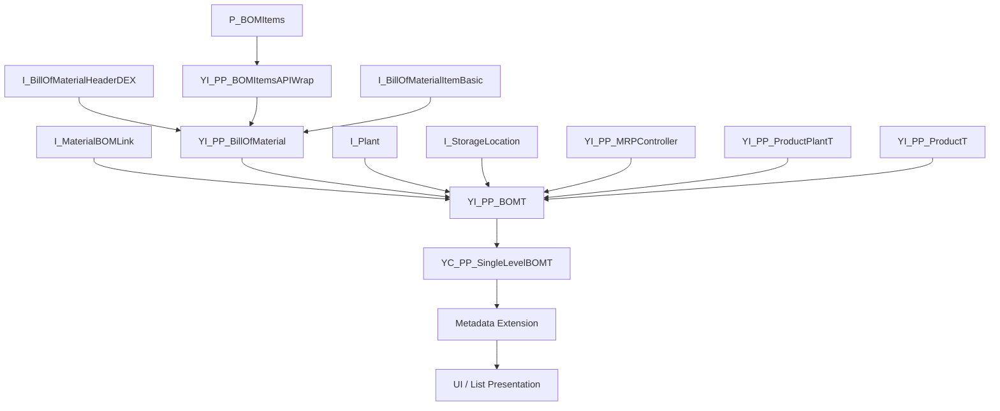

# rap demo4

## 処理概要
1. 本 Demo は BOM（Bill of Material）を対象とした CDS ベースのデータモデル例であり、BOM ヘッダ、BOM 明細、品目・プラント情報を組み合わせて単一レベル BOM データを提供する。
2. `YI_PP_BOMItemsAPIWrap` で SAP 標準の `P_BOMItems` をラップし、BOM 明細の基本情報を提供する。
3. `YI_PP_BillOfMaterial` で `I_BillOfMaterialHeaderDEX`、`YI_PP_BOMItemsAPIWrap`、`I_BillOfMaterialItemBasic` を結合し、BOM ヘッダと有効な明細情報を取得する。
4. `YI_PP_BOMT` で `I_MaterialBOMLink` と `YI_PP_BillOfMaterial` を結合し、プラント、BOM 使用、品目、代替 BOM、BOM 明細などをまとめる。
5. `YI_PP_BOMT` はプラント、保管場所、MRP Controller、品目・プラント情報を Association で取得し、最終的に `YC_PP_SingleLevelBOMT` が消費用データとして公開する。
6. `YC_PP_SingleLevelBOMT` では Selection Field、Line Item、Presentation Variant、Value Help などの UI メタデータを Metadata Extension に分離して定義する。

## 前提/制約条件

### 前提条件：
- SAP 標準 CDS / API `I_MaterialBOMLink`、`I_BillOfMaterialHeaderDEX`、`I_BillOfMaterialItemBasic`、`P_BOMItems` などが利用可能であること。
- `YC_PP_SingleLevelBOMT` が参照する Value Help の CDS が利用可能であること。
  
### 制約条件：
- `YI_PP_BillOfMaterial` は BOM Category を `M` に限定している。
- `YI_PP_BillOfMaterial` の BOM 明細は Validity Start / End Date と削除フラグの条件で絞り込まれる。
- `YI_PP_BOMT` の `HierarchyLevel`、`ProductionVersion`、`TopLevelMaterial`、`PreviousParentMaterial`、`FunctionType`、`ProcessingDate` は本 Demo 内で固定値または空値として定義されている。
- Metadata Extension の UI 定義は `YC_PP_SingleLevelBOMT` に対して適用される。

## 処理概要図



## 依存関係

### 使用公開API

| API名 | 種類 | 用途 |
|---|---|---|
| `YC_PP_SingleLevelBOMT` | カスタム CDS View Entity | 単一レベル BOM の消費用データモデルを提供する。 |
| `YI_PP_BOMT` | カスタム CDS View Entity | Material BOM Link と BOM データを結合し、BOM 一覧に必要な情報をまとめる。 |
| `YI_PP_BillOfMaterial` | カスタム CDS View Entity | BOM ヘッダと有効な BOM 明細を結合する。 |
| `YI_PP_BOMItemsAPIWrap` | カスタム CDS View Entity | `P_BOMItems` をラップして BOM 明細データを提供する。 |
| `YI_PP_MRPController` | カスタム CDS View Entity | 品目・プラントごとの MRP Controller と名称を取得する。 |
| `YI_PP_BOMUsageStdVH` | カスタム CDS View Entity | BOM Usage の Value Help を提供する。 |
| `YI_PP_DeletionFlagStdVH` | カスタム CDS View Entity | Deletion Flag の Value Help を提供する。 |
| `I_MaterialBOMLink` | SAP 標準 CDS View | 品目、プラント、BOM、代替 BOM、BOM Usage の関連を取得する。 |
| `I_BillOfMaterialHeaderDEX` | SAP 標準 CDS View | BOM ヘッダ情報を取得する。 |
| `I_BillOfMaterialItemBasic` | SAP 標準 CDS View | BOM 明細情報と有効期間・削除状態を取得する。 |
| `P_BOMItems` | SAP 標準 CDS View / API | BOM 明細の詳細データを取得する。 |
| `I_StorageLocation` | SAP 標準 CDS View | Issue Location の名称を取得する。 |
| `I_Plant` | SAP 標準 CDS View | Plant 名称を取得する。 |
| `I_ProductPlantBasic` | SAP 標準 CDS View | 品目・プラント単位の MRP Responsible を取得する。 |
| `I_MRPController` | SAP 標準 CDS View | MRP Controller 名称を取得する。 |
| `I_Language` | SAP 標準 CDS View | Deletion Flag Value Help の言語条件に使用する。 |
| `I_BillOfMaterialUsageStdVH` | SAP 標準 CDS View | BOM Usage Value Help の元データを提供する。 |
| `I_PlantStdVH` | SAP 標準 CDS Value Help | Plant の Value Help に使用する。 |
| `I_ProductStdVH` | SAP 標準 CDS Value Help | Material の Value Help に使用する。 |
| `YI_PP_MRPControllerVH` | CDS Value Help 参照 | MRP Controller の Value Help として参照される。Demo フォルダ内に定義は存在しない。 |
| `YI_PP_ProdSupervisorVH` | CDS Value Help 参照 | Production Supervisor の Value Help として参照される。Demo フォルダ内に定義は存在しない。 |
| `YI_PP_MatDescVH` | CDS Value Help 参照 | Material Description の Value Help として参照される。Demo フォルダ内に定義は存在しない。 |
| `YI_PP_ProductGroupVH` | CDS Value Help 参照 | Material Group の Value Help として参照される。Demo フォルダ内に定義は存在しない。 |
| `YI_PP_ProductPlantT` | カスタム CDS 参照 | 品目・プラントから Production Supervisor 情報を取得する Association の参照先。Demo フォルダ内に定義は存在しない。 |
| `YI_PP_ProductT` | カスタム CDS 参照 | Material Name、Material Group、Material Group Name を取得する Association の参照先。Demo フォルダ内に定義は存在しない。 |

## 詳細設計

`YI_PP_BOMItemsAPIWrap` は `P_BOMItems` を `select from` し、BOM Category、BOM、BOM Variant、Node Number をキーとして BOM 明細情報を公開する。数量・単位、金額・通貨、Validity、削除状態、Issue Location、Costing Relevant などの項目もそのまま取得する。

`YI_PP_BillOfMaterial` は `I_BillOfMaterialHeaderDEX` を起点として `YI_PP_BOMItemsAPIWrap` と Inner Join し、さらに `I_BillOfMaterialItemBasic` と Inner Join する。BOM Category、BOM、BOM Variant を結合キーとして使用し、BOM 明細 Node Number でも明細を対応付ける。`I_BillOfMaterialItemBasic` については Validity Start Date がシステム日付以下、Validity End Date がシステム日付以上、かつ `IsDeleted = ''` の条件を指定している。また、BOM Category は `M` に限定している。

`YI_PP_BOMT` は `I_MaterialBOMLink` と `YI_PP_BillOfMaterial` を BOM、Alternative BOM、BOM Usage で結合する。さらに `I_StorageLocation`、`I_Plant`、`YI_PP_MRPController`、`YI_PP_ProductPlantT`、`YI_PP_ProductT` を Association として定義し、Issue Location 名称、Plant 名称、MRP Controller、Production Supervisor、Material 名称および Material Group などを取得する。`HierarchyLevel` は `'00'`、`FunctionType` と `ProcessingDate`、`ProductionVersion`、`TopLevelMaterial`、`PreviousParentMaterial` は空値として定義されている。

`YC_PP_SingleLevelBOMT` は `YI_PP_BOMT` を参照する上位 CDS View Entity であり、Plant、BOM Usage、Material、Alternative BOM、Valid From Date、Material Description、Material Group、MRP Controller、Production Supervisor などを Selection Field として利用できるようにし、各項目を UI 表示用のフィールドとして公開する。Value Help には SAP 標準の `I_PlantStdVH`、`I_ProductStdVH` および Demo 内で定義された `YI_PP_BOMUsageStdVH`、`YI_PP_DeletionFlagStdVH` などを参照している。

Metadata Extension `YC_PP_SingleLevelBOMT.mdex.cds` では `@Metadata.layer: #CUSTOMER` を使用し、`YC_PP_SingleLevelBOMT` の Header Information、Presentation Variant、Selection Field、Line Item、Hidden Field を定義する。Presentation Variant では Plant、Material、Alternative BOM、Item Number の順に昇順ソートし、Line Item を表示対象としている。

本 Demo リポジトリ内に定義されていない SAP 標準 CDS および Value Help、ならびに `YI_PP_MRPControllerVH`、`YI_PP_ProdSupervisorVH`、`YI_PP_MatDescVH`、`YI_PP_ProductGroupVH`、`YI_PP_ProductPlantT`、`YI_PP_ProductT` は、実際のソース内で参照されているため依存関係に記載している。一方、それらの内部実装は本 Demo のファイルから確認できないため推測していない。

## 補足情報

### 目录構造
```text
demo4/
├── README.md
└── cds/
    ├── data_definitions/
    │   ├── YC_PP_SingleLevelBOMT.cds
    │   ├── YI_PP_BillOfMaterial.cds
    │   ├── YI_PP_BOMItemsAPIWrap.cds
    │   ├── YI_PP_BOMT.cds
    │   ├── YI_PP_BOMUsageStdVH.cds
    │   ├── YI_PP_DeletionFlagStdVH.cds
    │   └── YI_PP_MRPController.cds
    └── metadata_extensions/
        └── YC_PP_SingleLevelBOMT.mdex.cds
```

EOF
