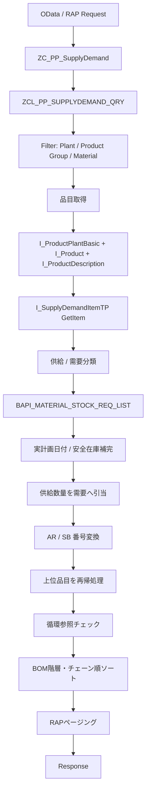

# rap demo5

## 処理概要
1. 本 Demo は RAP Custom Entity と Query Provider を使用し、品目・プラント・品目グループを条件として供給／需要データを取得する。
2. `ZC_PP_SupplyDemand` は `ZCL_PP_SUPPLYDEMAND_QRY` を Query Provider として指定し、供給／需要関係を Custom Entity として公開する。
3. Query Provider は Plant、Product Group、Material のフィルタを取得し、`I_ProductPlantBasic`、`I_Product`、`I_ProductDescription` から対象品目を取得する。
4. 対象品目ごとに `I_SupplyDemandItemTP` の `GetItem` を実行し、供給データと需要データを MRP 要素カテゴリに基づいて分類する。
5. `BAPI_MATERIAL_STOCK_REQ_LIST` から供給要素の実計画日付と安全在庫情報を補完し、供給数量を需要へ割り当てる。
6. 引当先が上位品目の場合は、必要な品目情報を取得して再帰的に供給／需要処理を行い、循環参照を防止しながら結果を構築する。
7. 最終結果を BOM 階層レベル、チェーンルート、所要日付、引当先 MRP 要素の順にソートし、RAP のページング情報を適用して返却する。

## 前提/制約条件

### 前提条件：
- RAP Custom Entity `ZC_PP_SupplyDemand` と Query Provider `ZCL_PP_SUPPLYDEMAND_QRY` を実行できる環境であること。
- SAP 標準の `I_SupplyDemandItemTP`、`I_ProductPlantBasic`、`I_Product`、`I_ProductDescription` などの公開 API が利用可能であること。
- 供給／需要データに対して日本語の品目テキストを取得するため、`I_ProductDescription` の言語コード `J` を使用する。

### 制約条件：
- Plant と Product Group が指定されていない場合、Query Provider は空結果を返す。
- Material が指定されている場合は Material を直接検索し、指定されていない場合は Product Group から対象品目を検索する。
- 出力対象の供給 MRP 要素カテゴリは `FE`、`PA`、`BE`、`BA`、`PP` に限定される。WB は数量計算には使用されるが出力・再帰処理の対象外である。
- 需要 MRP 要素カテゴリとして `AR`、`SB`、`UR`、`U1` を処理し、AR は予約番号から製造指図番号、SB は予約番号から計画手配番号への変換を試みる。
- MRP 要素説明は `PP` の場合はオーダ種別コードを使用し、それ以外は `DELKZ` の日本語ドメイン値テキストを使用する。
- RAP のページング情報に基づいて返却件数を制限する。

## 処理概要図



## 依存関係

### 使用公開API

| API名 | 種類 | 用途 |
|---|---|---|
| `ZC_PP_SupplyDemand` | RAP Custom Entity | 供給／需要関係データを公開する Custom Entity。 |
| `ZCL_PP_SUPPLYDEMAND_QRY` | ABAP Query Provider Class | Custom Entity のデータ取得、供給／需要割当、再帰処理、ソート、ページングを実装する。 |
| `IF_RAP_QUERY_PROVIDER` | RAP Interface | Query Provider として `select` 処理を実装する。 |
| `IF_RAP_QUERY_FILTER` | RAP Interface | OData/RAP リクエストのフィルタ条件を範囲形式で取得するために使用する。 |
| `I_SupplyDemandItemTP` | SAP 標準 RAP Business Object / API | `GetItem` を実行して MRP 供給／需要要素を取得する。 |
| `I_ProductPlantBasic` | SAP 標準 CDS View | 品目・プラント単位の品目情報、基本単位などを取得する。 |
| `I_Product` | SAP 標準 CDS View | 品目グループを取得する。 |
| `I_ProductDescription` | SAP 標準 CDS View | 日本語の品目テキストを取得する。 |
| `I_ReservationDocumentHeader` | SAP 標準 CDS View | AR の予約番号から製造指図番号を取得する。 |
| `A_PlannedOrderComponent` | SAP 標準 CDS View / API | SB の予約番号から計画手配番号を取得する。 |
| `BAPI_MATERIAL_STOCK_REQ_LIST` | SAP BAPI Function Module | MRP 要素の実計画日付および安全在庫情報を取得する。 |
| `DD07T` | SAP 標準データベーステーブル | `DELKZ` ドメインの日本語値テキストを取得する。 |
| `DELKZ` | SAP Data Element / Domain | MRP 要素カテゴリの値を表し、供給／需要種別および説明取得に使用する。 |

## 詳細設計

### Query Provider

`if_rap_query_provider~select` では RAP リクエストから Paging と Filter を取得する。Filter は `PLANT`、`MATERIAL`、`PRODUCTGROUP` を処理する。Plant または Product Group が空の場合は処理を終了し、空結果を返す。

Material が指定された場合は `get_material_by_code`、指定されていない場合は `get_material_by_group` を呼び出す。両メソッドは `I_ProductPlantBasic`、`I_Product`、`I_ProductDescription` を結合して、Plant、Material、Product Group、Material Text、Base Unit を取得する。

### 供給／需要データ取得

`process_supply_demand` では `I_SupplyDemandItemTP` の `SupplyDemandItem` Entity に対して `GetItem` を実行する。取得したデータを供給と需要に分類し、`AR`、`SB`、`UR`、`U1` を需要として扱い、`SH` は先頭に配置する。それ以外は供給として扱う。

供給数量の割当処理では、供給数量と需要残数量を比較し、需要が満たされるまで順次割り当てる。WB は期首在庫として扱い、安全在庫数量を控除する。また、最初の FE/PA 等の計画供給日を境界として、WB の充当範囲を制御する。

### MRP 要素情報の補完

`BAPI_MATERIAL_STOCK_REQ_LIST` を使用して MRP 要素の `AVAIL_DATE` を取得し、供給データの実計画日付を補完する。SH 行から安全在庫数量を取得し、WB の充当可能数量から控除する。

AR の需要要素については `I_ReservationDocumentHeader` を使用して予約番号から製造指図番号への変換を試みる。SB については `A_PlannedOrderComponent` を使用して予約番号から計画手配番号への変換を試みる。変換できない場合は元の MRP 要素番号を使用する。

### 上位品目の再帰処理

需要データの Assembly を引当先品目として扱い、引当先品目の Plant、Product Group、Material Text、Base Unit を一括取得する。結果を `ct_recursion_hist` に記録し、同一の処理経路を再度処理しないようにする。

最終結果では品目間の関係から BOM Level と Chain Root を計算する。反復回数に上限を設け、循環参照が存在する場合に無限ループしないよう制御する。

### 結果生成

供給 MRP 要素、供給品目、引当先 MRP 要素、引当先品目、引当数量、所要日付などを `ty_result` に格納する。MRP 要素説明は `get_mrp_element_description` で取得し、`convert_alloc_element_type` で AR→FE、SB→PA、U1→BE、UR→BA の引当先種別変換を行う。

最後に Chain Root、BOM Level、Requirement Date、Allocation MRP Element の順で結果をソートし、RAP の Offset と Page Size を適用して `io_response` に返却する。

### デバッグログ

処理中には Filter、品目取得件数、Supply/Demand 取得件数、Demand 有無、処理結果件数などを `ty_log` に記録する。`build_log_result` はこのログを Custom Entity の結果型に変換できるが、通常の `select` 処理では最終結果そのものを返却する。

## 補足情報

### 目录構造
```text
demo5/
├── README.md
├── cds/
│   └── ZC_PP_SupplyDemand.cds
└── class/
    └── ZCL_PP_SUPPLYDEMAND_QRY.abap
```

EOF
