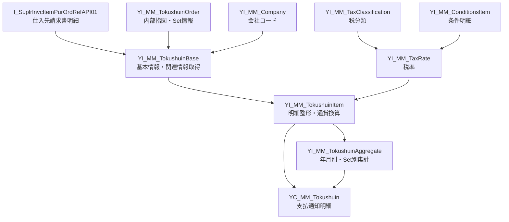

# rap demo6

## 処理概要
1. 仕入先請求書明細を基点として、購買発注、仕入先、支払条件、会社コード、税率、内部指図などの情報を関連付ける。
2. 仕入先請求書明細の金額・税額・請求総額を、購買組織の通貨へ換算して明細データを作成する。
3. 指定した年月の明細を仕入先・Set・税率・集計通貨単位で集計し、換算後金額から合計税額を算出する。
4. 明細データと集計結果を結合し、支払通知データとして出力する。

## 前提/制約条件

### 前提条件：
- `YC_MM_Tokushuin` の `P_YearMonth` に対象年月を指定する。
- 税率は `YI_MM_TaxClassification` と `YI_MM_ConditionsItem` から取得し、Application が `TX` の税分類を対象とする。
- Set 情報は内部指図の情報を基に取得し、`SetID` が `T` で始まるデータを対象とする。

### 制約条件：
- 本 Demo は CDS View Entity の定義のみで構成され、登録・更新処理や UI 実装は含まれない。
- 集計および最終出力は `PostingYearMonth` を指定年月と比較して対象データを絞り込む。
- 通貨換算は仕入先購買組織の購買発注通貨を対象通貨として、請求書の転記日を換算日として実行する。

## 処理概要図


## 依存関係

### 使用公開API

| API名 | 種類 | 用途 |
|---|---|---|
| YC_MM_Tokushuin | Custom CDS View Entity | 支払通知データの最終出力。明細と集計結果を指定年月で結合 |
| YI_MM_TokushuinItem | Custom CDS View Entity | 支払通知明細の整形、税率取得、通貨換算 |
| YI_MM_TokushuinBase | Custom CDS View Entity | 仕入先請求書明細を基点に購買・仕入先・支払・税情報などを関連付け |
| YI_MM_TokushuinAggregate | Custom CDS View Entity | 指定年月の換算済み明細を仕入先・Set・税率・通貨単位で集計 |
| YI_MM_TokushuinOrder | Custom CDS View Entity | Journal Entry の内部指図から Set 情報を取得 |
| YI_MM_Company | Custom CDS View Entity | 会社コードと税免税コードを取得 |
| YI_MM_TaxRate | Custom CDS View Entity | 国・税コード単位の税率を算出 |
| YI_MM_TaxClassification | Custom CDS View Entity | 国・税コードと税条件レコードを取得 |
| YI_MM_ConditionsItem | Custom CDS View Entity | 条件レコードから税率計算用の条件値を取得 |
| I_SuplrInvcItemPurOrdRefAPI01 | SAP Standard CDS View/API | 仕入先請求書明細と購買発注参照情報の基点 |
| I_SupplierInvoiceAPI01 | SAP Standard CDS View/API | 仕入先請求書ヘッダ、会社コード、通貨、支払情報、請求総額などを取得 |
| I_SupplierInvoiceTaxAPI01 | SAP Standard CDS association/API | 仕入先請求書の税額を税コード単位で取得 |
| I_Supplier | SAP Standard CDS View/API | 仕入先の住所・名称・電話番号などを取得 |
| I_SettlementPaymentMethod | SAP Standard CDS View/API | 国・支払方法に対応する支払方法名称を取得 |
| I_JournalEntryItem | SAP Standard CDS View/API | 内部指図、支払期日、購買伝票などの会計情報を取得 |
| I_PurchaseOrderAPI01 | SAP Standard CDS View/API | 購買発注の購買組織を取得 |
| I_PurchaseOrderItemAPI01 | SAP Standard CDS View/API | 購買発注明細のテキスト、正味価格数量・金額を取得 |
| I_SupplierPurchasingOrg | SAP Standard CDS View/API | 仕入先購買組織の購買発注通貨を取得 |
| I_Businesspartnertaxnumber | SAP Standard CDS View/API | Business Partner の税番号を取得 |
| I_Setleaf | SAP Standard CDS View/API | 内部指図に対応する Set の範囲情報を取得 |
| T001 | Database Table | 会社コードから税免税コードを取得 |
| A003 | Database Table | 国・税コードと税条件レコードの対応を取得 |
| KONP | Database Table | 税条件レコードの条件値を取得 |
| I_InternalOrder | SAP Standard CDS association | 内部指図の追加属性 `IntOrderIndividualField10Value` を参照 |
| currency_conversion | CDS Built-in Function | 請求書通貨から仕入先購買組織の購買発注通貨へ金額を換算 |

## 詳細設計
`YI_MM_TokushuinBase` が仕入先請求書明細 `I_SuplrInvcItemPurOrdRefAPI01` を基点とする。仕入先請求書ヘッダ、仕入先、支払方法、購買発注、購買発注明細、仕入先購買組織、Business Partner 税番号、会社コード、税率、内部指図・Set 情報を association で関連付ける。借方・貸方区分に応じて仕入先請求書明細金額、税額、請求総額の符号を調整する。

`YI_MM_TaxClassification` は `A003` から Application、Condition Type、Country、Tax Code、Condition Record を取得する。`YI_MM_ConditionsItem` は `KONP` から条件レコードの条件値を取得し、`YI_MM_TaxRate` が Application = `TX`、条件明細の連番 = `01` を条件として税率を算出する。

`YI_MM_TokushuinItem` は Base View の結果を支払通知明細として整形する。仕入先情報および支払方法名称を取得し、仕入先購買組織の購買発注通貨を `SumCurrency` とする。`currency_conversion` を使用し、請求書通貨から `SumCurrency` へ明細金額、税額、請求総額を転換する。

`YI_MM_TokushuinAggregate` は指定年月の `YI_MM_TokushuinItem` を対象として、仕入先、Set、税率、集計通貨単位でグループ化する。換算後の明細金額を合計し、税率を乗算して合計税額を算出する。

`YI_MM_Tokushuin` は `YI_MM_TokushuinItem` と `YI_MM_TokushuinAggregate` を仕入先、Set、税率、集計通貨で結合し、明細金額、税額、請求総額および集計税額を支払通知データとして提供する。最終結果は `PostingYearMonth` と入力パラメータ `P_YearMonth` が一致する明細に限定される。

`YI_MM_TokushuinOrder` は `I_JournalEntryItem` から内部指図と購買伝票情報を取得し、`I_Setleaf` の EQ または BT の範囲条件から Set を特定する。また、ReferenceDocumentType = `MKPF`、SourceLedger = `0L`、Ledger = `0L`、SetID が `T%`、内部指図の `IntOrderIndividualField10Value = X` という条件を設定する。

## 補足情報

### 目录構造
```text
sap/abap/rap/demo6/
└── cds/
    ├── YC_MM_Tokushuin.cds
    ├── YI_MM_Company.cds
    ├── YI_MM_ConditionsItem.cds
    ├── YI_MM_TaxClassification.cds
    ├── YI_MM_TaxRate.cds
    ├── YI_MM_TokushuinAggregate.cds
    ├── YI_MM_TokushuinBase.cds
    ├── YI_MM_TokushuinItem.cds
    └── YI_MM_TokushuinOrder.cds
```

EOF
