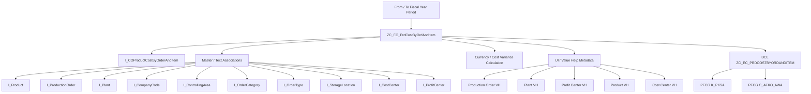

# rap demo7

## 処理概要
1. Consumption CDS View Entity `ZC_EC_PrdCostByOrdAndItem` は、指定した会計年度期間をパラメータとして `I_COProductCostByOrderAndItem` から製造指図・指図明細単位の製造原価データを取得する。
2. 製造指図、Plant、会社コード、Controlling Area、指図カテゴリ、指図タイプ、保管場所、責任原価センタ、利益センタ、および Product の標準 CDS View を Association で参照し、名称・マスタ情報を補完する。
3. Currency Role に応じて管理領域通貨または会社コード通貨の原価・差異金額を表示用通貨へ変換し、実際原価、計画原価、目標原価、原価差異、WIP、出力量などを公開する。
4. Production Order、Plant、Profit Center、Product、Cost Center などの Value Help と UI Selection Field / Line Item / Field Group を定義し、製造原価分析用の Consumption View として利用できるようにする。
5. DCL `ZC_EC_PRDCOSTBYORDANDITEM` により、Product Cost Collector または PP Order に対する PFCG 権限を使用して参照権限を制御する。

## 前提/制約条件

### 前提条件：
- SAP 標準 CDS View `I_COProductCostByOrderAndItem` および関連する標準 CDS View / Value Help が利用可能であること。
- Consumption View のパラメータとして From Fiscal Year/Period、To Fiscal Year/Period、System Language、Currency Role を指定できること。
- PFCG 権限オブジェクト `K_PKSA` および `C_AFKO_AWA` を使用した参照権限が設定されていること。
  
### 制約条件：
- 原価金額の表示通貨はパラメータ `P_CurrencyRole` により管理領域通貨または会社コード通貨のいずれかに決定される。
- DCL の参照権限は Activity = `03` の参照権限を前提とする。
- Demo 内には Service Definition / Service Binding / ABAP Class 等の追加実装は存在せず、CDS Data Definition と Access Control によって構成されている。

## 処理概要図



## 依存関係

### 使用公開API

| API名 | 種類 | 用途 |
|---|---|---|
| `I_COProductCostByOrderAndItem` | SAP 標準 CDS View / 公開 API | 製造指図・指図明細の製造原価、計画原価、目標原価、差異、WIP、出力量などの基礎データを取得する。 |
| `I_Product` | SAP 標準 CDS View / 公開 API | Product マスタ情報および Product に紐づく拡張項目・テキストを参照する。 |
| `I_ProductionOrder` | SAP 標準 CDS View / 公開 API | Production Order のマスタ情報を Association で参照する。 |
| `I_Plant` | SAP 標準 CDS View / 公開 API | Plant 名称を取得する。 |
| `I_CompanyCode` | SAP 標準 CDS View / 公開 API | Company Code 名称を取得する。 |
| `I_ControllingArea` | SAP 標準 CDS View / 公開 API | Controlling Area を参照する。 |
| `I_OrderCategory` | SAP 標準 CDS View / 公開 API | Order Category 名称を取得する。 |
| `I_OrderType` | SAP 標準 CDS View / 公開 API | Order Type 名称を取得する。 |
| `I_StorageLocation` | SAP 標準 CDS View / 公開 API | Storage Location 名称を取得する。 |
| `I_CostCenter` | SAP 標準 CDS View / 公開 API | Responsible Cost Center および Product の Cost Center 名称を参照する。 |
| `I_ProfitCenter` | SAP 標準 CDS View / 公開 API | Profit Center および Profit Center 名称を参照する。 |
| `I_PRODUCTIONORDERSTDVH` | SAP 標準 CDS Value Help | Production Order の Value Help および入力値検証に使用する。 |
| `I_PlantStdVH` | SAP 標準 CDS Value Help | Plant の Value Help および入力値検証に使用する。 |
| `I_PROFITCENTERSTDVH` | SAP 標準 CDS Value Help | Profit Center の Value Help および Controlling Area / Validity End Date による追加バインディングに使用する。 |
| `I_ProductStdVH` | SAP 標準 CDS Value Help | Material / Product の Value Help および入力値検証に使用する。 |
| `I_COSTCENTERSTDVH` | SAP 標準 CDS Value Help | Cost Center の Value Help および Controlling Area / Validity End Date による追加バインディングに使用する。 |
| `ZC_EC_PrdOrdStatusVH` | Demo 参照 CDS Value Help | Controlling Object Status の Value Help および入力値検証に使用する。Demo 内では定義されておらず、外部 CDS として参照する。 |
| `K_PKSA` | PFCG Authorization Object | Product Cost Collector に対する Plant / Activity の参照権限を DCL でチェックする。 |
| `C_AFKO_AWA` | PFCG Authorization Object | PP Order に対する Order Category / Order Type / Plant / Activity の参照権限を DCL でチェックする。 |

## 詳細設計
`ZC_EC_PrdCostByOrdAndItem` は、パラメータ `P_FromFiscalYearPeriod`、`P_ToFiscalYearPeriod`、`P_Language`、`P_CurrencyRole` を受け取り、`I_COProductCostByOrderAndItem` を基礎データソースとして Consumption View を構成する。基礎 CDS には Planning Category = `000`、Result Analysis Version = `000`、Valuation Type = 空値を固定指定する。

Order ID と Order Item をキーとして公開し、Order Type / Order Category / Plant / Company Code / Profit Center / Material などについて標準 CDS View との Association を設定する。Order Type、Order Category、Plant、Company Code、Profit Center、Storage Location、Product および Cost Center についてテキスト・名称項目を取得する。

原価項目は `P_CurrencyRole` の値が `20` の場合に Controlling Area Currency、それ以外の場合に Company Code Currency を使用する CASE 式で表示通貨を決定する。同じ判定方式で Actual Cost、Variable Cost、Fixed Cost、Plan Cost、Target Cost、Control Cost および各種原価差異を表示用金額へ変換する。

Cost Variance は入力価格差異、入力数量差異、資源使用差異、Input Remaining 差異、Mixed Price 差異、Output Price 差異、Lot Size 差異、Output Quantity 差異および Output Remaining 差異を加算して算出する。また、Actual / Plan / Target の差異金額・差異率、WIP、未実現原価引当、Total WIP Amount、Plan Output Quantity、Actual Output Quantity などを公開する。

UI Metadata として Production Order、Plant、Profit Center、Material、Cost Center、Controlling Object Status の Selection Field および Value Help を設定し、Line Item、Field Group、Facet、Intent-Based Navigation のための Metadata も定義する。Production Order について semantic object `ProductionOrder` と action `analyzeProductionCost` を使用する。

Access Control `ZC_EC_PRDCOSTBYORDANDITEM` は `ZC_EC_PRDCOSTBYORDANDITEM` に対する SELECT 権限を定義し、Product Cost Collector 用の `K_PKSA` と PP Order 用の `C_AFKO_AWA` のいずれかを満たす場合に参照を許可する。両方の PFCG 権限チェックでは Activity `03` を指定する。

## 補足情報

### 目录構造
```text
sap/abap/rap/demo7/
├── .gitkeep
└── cds/
    ├── .gitkeep
    ├── access_controls/
    │   ├── .gitkeep
    │   └── ZC_EC_PRDCOSTBYORDANDITEM.cds
    └── data_definitions/
        ├── .gitkeep
        └── ZC_EC_PrdCostByOrdAndItem.cds
```

EOF
